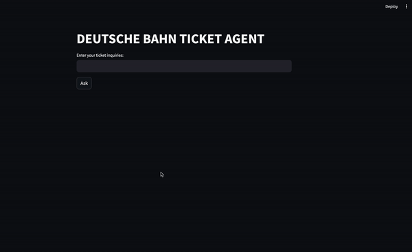

# Deutsche Bahn Ticket AI Agent

Deutsche Bahn Ticket Agent is an AI-powered agent designed to find the best possible travel options on Deutsche Bahn ICE and IC trains based on your specified date and time, optimizing for price and convenience.

## Features

1. **Optimized Travel Suggestions** : Get the best possible travel itinerary based on your preferred date and time, with a focus on price efficiency.
2. **Deutsche Bahn ICE and IC Trains** : The agent exclusively supports high-speed (ICE) and InterCity (IC) trains for reliable and fast travel options.
3. **AI-Powered Search**: Leverages OpenAI's API to provide intelligent and context-aware travel recommendations.

## Requirements

**OPENAI_API_KEYS**: You must have an OpenAI API key to use the AI features of the Deutsche Bahn Ticket Agent. Put it inside the .env in the app directory

To obtain an API key, sign up at [OpenAI](https://platform.openai.com/docs/api-reference/introduction) and follow their instructions to get started.


## Installation

To run the Deutsche Bahn Ticket Agent locally, you will need to use Docker. Follow the steps below to set up the project:

1. **Clone the Repository**
    ```bash
    git clone https://github.com/sandeep135/DB-Ticket-AI-Agent.git
    cd Deutsche-Bahn-Ticket-Agent
    ```

2. **Set Up Environment Variables**

   Create a `.env` file in the root directory of the project and add your OpenAI API key:

    ```bash
    OPENAI_API_KEY=your_openai_api_key_here
    ```

3. **Build and Run with Docker**

    Build the Docker image:
    ```bash
    docker build -t db-ticket-agent .
    ```

    Run the Docker container:
    ```bash
    docker run -d --name app -p 8000:8000 db-ticket-agent
    ```

Once the container is running, you can access the application by navigating to http://localhost:8000/db-agent/invoke in your web browser. Add the body 

````json
{
    "input": "Your Question should be here" 
}

to the with HTTP POST method

## Usage



**Input Travel Details**: Enter your desired travel date, time, and any other preferences.

**Get Recommendations**: The AI agent will suggest the best travel options based on your criteria.
    
**Book Your Trip**: Select your preferred option and proceed with booking.(Upcoming)

## Contributing

Contributions are welcome! If you find a bug or have a feature request, please open an issue or submit a pull request.


License

This project is licensed under the [MIT](https://choosealicense.com/licenses/mit/) License - see the LICENSE file for details.
